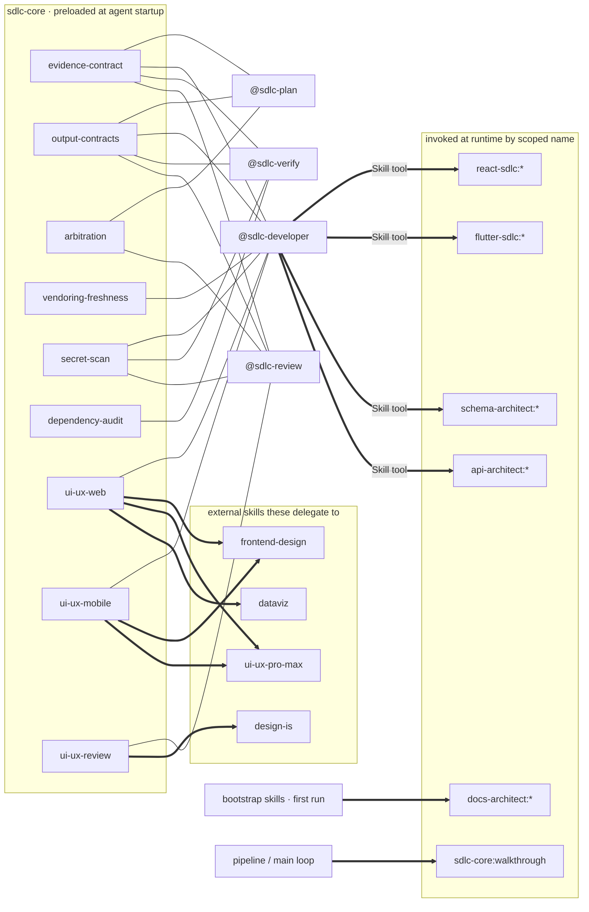
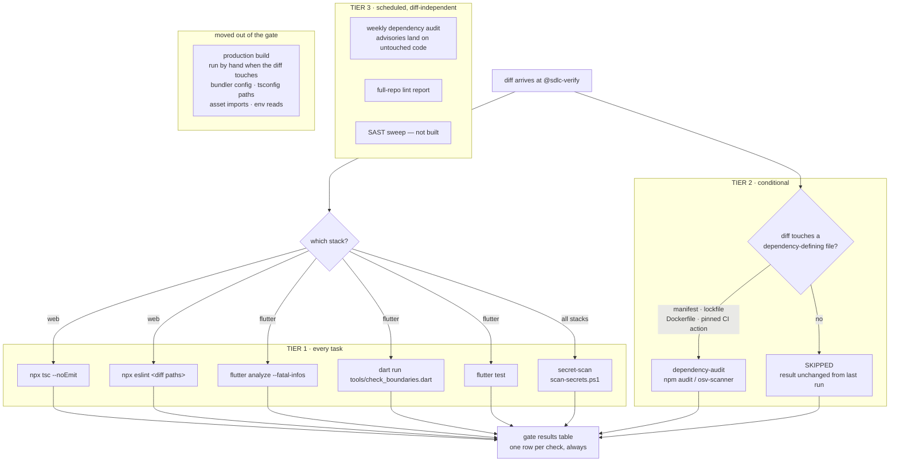

# sdlc-automation

A local Claude Code plugin marketplace: **6 plugins · 4 agents · 31 skills**.

Human-triggered, agent-assisted delivery across React/web, Flutter/mobile, Oracle schema, and REST APIs. You tag work with a task; the pipeline plans it, implements one vertical slice, gates itself on build quality and security, and hands back a written walkthrough plus an uncommitted diff.

Two things it will never do: proceed past a decision that's yours to make, and mutate git state.

---

## Install

```bash
/plugin marketplace add MobileDevNalsoft/sdlc-automation
/plugin install sdlc-core@sdlc-automation
/plugin install react-sdlc@sdlc-automation        # or flutter-sdlc, schema-architect, api-architect, docs-architect
/reload-plugins
```

`sdlc-core` is required — it owns the agents and the shared process skills every stack plugin builds on. Install whichever stack plugins match what you work on.

Then run:

```
/sdlc-core:sdlc-task <task-id or description>
```

> Plugin skills and commands are namespaced. It's `/sdlc-core:sdlc-task`, not `/sdlc-task`.

---

## What happens when you run it

Ten steps, two human checkpoints, no agent-initiated git writes.

```mermaid
flowchart TD
    START(["/sdlc-task [task-id]"]) --> LOCK

    subgraph GATE0 ["Step 1-2 · Admission"]
        LOCK{"Serial-execution lock<br/>walkthrough non-terminal?<br/>plan awaiting approval?"}
    end

    LOCK -->|"either exists"| REFUSE["REFUSE<br/>name the blocking task, stop"]
    LOCK -->|"clear"| PLAN

    subgraph S3 ["Step 3 · Plan"]
        PLAN["@sdlc-plan<br/>Read Write Edit Grep Glob WebFetch"]
        PLAN --> T3T["3-tier context load<br/>code-review-graph → graphify → llmwiki"]
        T3T --> SDR["Skill Decision Record<br/>+ rejected candidates"]
        SDR --> STRAT{"Execution strategy"}
        STRAT --> PFILE["writes docs/plans/&lt;task-id&gt;.md"]
    end

    PFILE --> TOK1{"PLAN-READY<br/>or NEEDS-DECISION"}
    TOK1 --> HUMAN1

    HUMAN1{{"HUMAN CHECKPOINT 1<br/>approve the plan"}}
    HUMAN1 -->|"decision needed"| PLAN
    HUMAN1 -->|"approved"| DEV

    subgraph S5 ["Step 5 · Implement"]
        DEV["@sdlc-developer<br/>Read Write Edit Grep Glob Bash"]
        DEV --> MODE{"honors plan's strategy"}
        MODE -->|"INLINE"| SLICE["dispatch stack slice skill"]
        MODE -->|"SUBAGENT-DRIVEN"| UNITS["one subagent per unit<br/>exclusive file ownership"]
        UNITS --> INTEG["integration step"]
        SLICE --> UIUX["UI touched?<br/>→ ui-ux-web / ui-ux-mobile"]
        INTEG --> UIUX
    end

    DEV -.->|"needs unlisted file"| SCOPE["SCOPE-REQUEST<br/>no terminal token"]
    SCOPE --> HUMANX{{"HUMAN<br/>approve this file, this edit"}}
    HUMANX --> DEV

    UIUX --> TOK2{"IMPLEMENTED<br/>or BLOCKED"}
    TOK2 --> PAR

    PAR["dispatch both gates on the same diff"]
    PAR --> VER
    PAR --> REV

    subgraph S6 ["Step 6 · Gates run in parallel"]
        VER["@sdlc-verify<br/>Read Grep Glob Bash"]
        REV["@sdlc-review<br/>Read Grep Glob ReportFindings<br/>git diff/status/log/show only"]
    end

    VER --> VTOK{"GATE-PASS<br/>or GATE-FAIL"}
    REV --> RTOK{"SHIP<br/>or DO-NOT-SHIP"}

    VTOK -->|"GATE-FAIL after 2 cycles"| ROUTE
    RTOK -->|"DO-NOT-SHIP"| ROUTE
    ROUTE["ROUTE-TO-DEVELOPER<br/>verbatim failure + file:line"] --> DEV2["@sdlc-developer<br/>fix only what was named"]
    DEV2 --> RERUN["re-run both gates ONCE<br/>free of the 2-cycle budget"]
    RERUN --> WT

    VTOK -->|"GATE-PASS"| WT
    RTOK -->|"SHIP"| WT

    WT["Step 8 · walkthrough skill<br/>docs/walkthroughs/&lt;task-id&gt;.md"]
    WT --> STATUS["Step 9 · tracker status<br/>or say plainly there is none"]
    STATUS --> HUMAN2{{"HUMAN CHECKPOINT 2<br/>walkthrough + uncommitted diff"}}
    HUMAN2 --> STOP(["STOP — no commit, no push<br/>git writes are always human"])
```



Dotted is the scope-expansion escape hatch. It produces **no terminal token** because the agent is waiting for an answer, not finished.

---

## The four agents

Each declares an explicit tool allowlist — never `*` — and ends on one uppercase token so a dispatcher can route on the final line.

| Agent | Tools | Ends on |
|---|---|---|
| **@sdlc-plan** | `Read, Write, Edit, Grep, Glob, WebFetch` | `PLAN-READY` / `NEEDS-DECISION` |
| **@sdlc-developer** | `Read, Write, Edit, Grep, Glob, Bash` | `IMPLEMENTED` / `BLOCKED` |
| **@sdlc-verify** | `Read, Grep, Glob, Bash` | `GATE-PASS` / `GATE-FAIL` |
| **@sdlc-review** | `Read, Grep, Glob, ReportFindings, Bash(git diff/status/log/show)` | `SHIP` / `DO-NOT-SHIP` |

**@sdlc-plan** loads context before reading source, names every file it will touch, records rejected skill candidates with reasons, and chooses whether execution should be inline or split across subagents. Its `Write`/`Edit` exist to author `docs/plans/<task-id>.md` and nothing else.

**@sdlc-developer** is the only agent that may write source. It implements exactly the approved plan, in dependency order, and raises a `SCOPE-REQUEST` rather than quietly touching an unlisted file. An approval covers one file for one edit — never standing permission.

**@sdlc-verify** establishes the diff itself via read-only git, runs the stack's command set, and quotes real exit codes. It gets 2 auto-fix cycles and 4 total gate runs per task. Don't downgrade it to a cheaper model: it parses compiler output, where a shallow read turns a failure into a false pass.

**@sdlc-review** reviews by reading. Its shell is scoped to four read-only git verbs on purpose — a reviewer that can execute the code reviews by running it instead of reading it.

> **Why verify and review are separate agents:** entirely to control who gets a shell. And why they run in parallel: chaining them means a security finding can't surface until the build is green, which hides one class of problem behind another.

---

## Skill preloading vs. runtime dispatch

Two different mechanisms. Frontmatter `skills:` injects a skill's full text into the subagent at startup — but only for skills in the **same plugin**. Everything cross-plugin is invoked by scoped name at runtime.



Thin lines are startup injection; thick arrows are runtime Skill-tool calls. Cross-plugin preloading is unproven, so the design never relies on it.

---

## The gate, and when each check fires

One rule sorts everything: **a check belongs in the per-task gate only if the diff can change its result.**



### Five result states

| State | Meaning | Verdict |
|---|---|---|
| `PASS` | Ran, returned a real report, nothing at or above threshold | — |
| `FAIL` | Ran and found something | exit 1 |
| `SKIPPED` | Conditional check correctly didn't fire — no trigger in the diff | exit 0, reported as `SKIPPED` |
| `NOT RUN` | Tool absent or invocation failed. **A missing tool is never a pass** | exit 2, INCOMPLETE |
| `NOT COVERED` | Permanent documented scope gap, e.g. container image scanning | — |

Three distinctions do real work:

- **`SKIPPED` is not `PASS`.** Collapsing them is the same defect as reporting an unexecuted command as passing. A broken trigger that silently reads green is worse than no check, because it manufactures confidence.
- **`NOT COVERED` is not `NOT RUN`.** A permanent scope gap differs from a tool that should have worked and didn't. Counting the former as the latter makes *every* run INCOMPLETE — and a check that's always incomplete gets ignored.
- **Parsing successfully is not having a report.** `npm audit` emits its own errors as valid JSON (`{"error":{"code":"ENOLOCK"}}`) that parses cleanly and contains zero vulnerabilities. The runner requires the report shape before trusting a zero count.

### Why there's no production build in the gate

It's the slowest check available, re-runs every fix cycle, and largely re-proves what `tsc` already established. What escapes: bundler-vs-tsconfig alias mismatches, plugin/transform config errors, asset imports that type-check via a `.d.ts` but have no file behind them, import cycles, and missing build-time env values.

That's acceptable rather than reckless because **the release path still bundles** — `react-ship`'s container build runs it. A broken build fails at ship, not silently. Run it by hand when the diff touches bundler config, tsconfig paths, an alias, an asset pipeline, or an env read.

---

## All 26 skills

### `sdlc-core` — process (10)

| Skill | Verb | Fires when |
|---|---|---|
| `evidence-contract` | attest | Preloaded into all four agents. The only three evidence shapes: exit code + output, `file:line`, or a fetched URL. Everything else carries an inline `ASSUMPTION:` prefix. |
| `output-contracts` | emit | Preloaded into all four. Output templates and forced tokens in one place, so four agent bodies can't drift. |
| `secret-scan` | scan | **Tier 1, every task.** 11 rules plus an executable engine. Blocking. |
| `dependency-audit` | audit | **Tier 2** on trigger paths, **Tier 3** on a schedule. Expiring suppressions only. |
| `ui-ux-web` | design (web) | The diff touches web UI. Orders taste → data → compliance. |
| `ui-ux-mobile` | design (mobile) | The diff touches mobile UI. Adds platform idioms, safe areas, thumb reach. |
| `ui-ux-review` | review (UI/UX) | Preloaded into review. 11 defect categories plus a Rams principle pass. |
| `arbitration` | arbitrate | Two stages disagree. Writes `docs/decisions/` and escalates rather than letting the later agent win. |
| `vendoring-freshness` | refresh | Copying external content. Provenance header, license check, strip persona preambles. |
| `walkthrough` | document | Pipeline step 8. Manual-verification steps and `Not done` are both mandatory and non-empty. |

### `react-sdlc` — web (4)

| Skill | Verb | What it owns |
|---|---|---|
| `react-bootstrap` | scaffold | Greenfield or adopt-in-place version profiles, plus a full `src/` overlay: axios client with single-flight 401 refresh, idempotent-only retry, an `ApiError` union, react-router 8 with a pre-mount auth guard, typed runtime config, storage behind interfaces, Zustand slices, Tailwind v4 tokens, i18n. ESLint 10 flat config whose feature-boundary rule is proven to fire. Reverse-proxy auth so no credential reaches the browser. |
| `react-slice` | slice | The vertical seam: DTO → transformer → `BaseApiService` → query/mutation typed with `ApiError` → component rendering all four states. Delegates every visual decision to `ui-ux-web`. |
| `react-verify` | gate | typecheck + diff-scoped lint via `gate.ps1`, including the boundary rule and its silent-no-op re-proof. |
| `react-ship` | release | Refuses to run until five unverified container behaviours are confirmed once. |

### `docs-architect` — documentation (4)

Split by **source of truth and refresh trigger**, not by stack — four stacks × four doc types would be sixteen skills that all drift.

| Skill | Verb | What it owns |
|---|---|---|
| `docs-context` | index | The 3-tier agent context: `code-review-graph` (AST/blast radius), `graphify` (structural), `llmwiki/` (architecture memory). Creates them for greenfield or existing projects. `ensure-context.ps1` reports NOT RUN for an absent tool and STUB for an unauthored wiki, and exits non-zero for both — a placeholder must not read as documentation. |
| `docs-onboarding` | onboard | One `CODEBASE_ONBOARDING.md` owning the **cross-stack request trace** (React click → ORDS → PL/SQL → table → back), plus a per-stack deep-dive for each stack actually detected. A fact lives in exactly one file; everything else links. `Flaws and risks` is a required section. |
| `docs-reference` | reference | Exhaustive schema and API reference generated from the **live dictionary**, not from source files — so a disagreement with the checked-in DDL is real deployment drift, reported rather than reconciled. Reports column-comment coverage as a percentage. |
| `docs-guide` | guide | End-user, task-oriented guides with a checked-in **screenshot manifest** so images are regenerable rather than hand-pasted. Masks identifying data before capture. With no browser tool: writes guides and manifest, reports screenshots NOT RUN — never a placeholder image, never a described screen it did not see. |

### `flutter-sdlc` — mobile (4)

| Skill | Verb | What it owns |
|---|---|---|
| `flutter-bootstrap` | scaffold | Strict analysis baseline plus a brownfield suppression layer, flavor entrypoints, a ~20-line boundary checker instead of an analyzer plugin. |
| `flutter-slice` | slice | Service → Repository returning sealed `Result` → Cubit → Screen with exhaustive `switch`. `flutter_bloc` is settled; Cubit vs full Bloc is the only per-feature choice. |
| `flutter-verify` | gate | Blocking: analyze, boundaries, tests. Advisory: bloc lint, coverage ratchet. |
| `flutter-ship` | release | Android flavors and signing, obfuscation paired with symbol retention. iOS is a documented stub. |

### `schema-architect` — database (5)

| Skill | Verb | What it owns |
|---|---|---|
| `schema-model` | model | Nine-step request → DDL procedure, per-FK `ON DELETE` rationale, and the FK-indexing step Oracle doesn't do for you. Owns the naming contract for **data objects**. |
| `plsql-conventions` | conform | Rules P1–P20: the naming contract for **program units** (`_p` procedures, `_f` functions, `_pkg` packages, `l_`/`p_`/`g_` scope prefixes) and the large-data mechanics — `BULK COLLECT ... LIMIT`, CLOB assembly, and why `l_body := l_body \|\| x` in a loop is O(n²). P17 (no request state in package globals under pooled connections) is a security rule, not a tidiness one. |
| `schema-emit` | emit-ddl | Business, junction, and lookup templates. Identity columns for greenfield; sequence + trigger as the adopt-in-place path. |
| `schema-audit` | audit | Four scripts written as exhaustive negative filters, so an empty result is a real pass. |
| `schema-promote` | promote | Six-phase promotion, grants first, explicit per-object grants, invalid-object check last, rollback policy by change class. |

### `api-architect` — API (4)

| Skill | Verb | What it owns |
|---|---|---|
| `api-contract` | contract | Numbered rules A1–A23 so a review can cite a violation by number. Real HTTP status codes and RFC 9457 `problem+json` are the default; the always-200 pattern is a labelled legacy path. A7 carries the ORDS pagination facts (`:fetch_offset`/`:fetch_size`; `:page_size` is deprecated **and reserved**; a PL/SQL handler's ref cursor is **not** auto-paginated); A23 decides whether a collection needs bounding at all. |
| `api-emit-handler` | emit-handler | Collection, by-id, and write-operation templates. Validation before any mutation; instrumentation at every entry point. |
| `api-audit` | audit | Diffs the declared surface against what's actually deployed, both directions, plus a scan for request-scoped state held at module scope. |
| `api-publish` | publish | Teardown → define → enable → drift audit → runnable smoke test. The checked-in file is truth. |

---

## The rules that bound the loop

- **Two human checkpoints.** Plan approval, and the final walkthrough review. A `NEEDS-DECISION` can't be defaulted past.
- **No agent mutates git.** Read-only `git diff`, `status`, `log`, `show` are permitted. Commit, push, reset, stash are always human.
- **Serial execution.** One task in flight. Without branch isolation, two tasks in one working tree interleave indistinguishably by review time — so an unfinished walkthrough or an unapproved plan blocks admission.
- **Bounded cycles.** Verify gets 2 auto-fix cycles and 4 total gate runs. Review gets 0 — it's read-only. A security-fix re-run is free of the budget.
- **A failure is never hidden to manufacture green.** If a security fix breaks the build, the walkthrough goes `RED` stating both facts. The fix is not reverted.
- **An unexecuted command is `NOT RUN`.** Never a pass, never omitted. Every other rule here defers to this one.

---

## Status, honestly

- **The plugin loader has not accepted these files.** Structure, frontmatter, reference resolution, and tool allowlists were verified; nothing here has been installed as a plugin by Claude Code yet.
- **`react-sdlc`'s templates ARE execution-verified (2026-07-31).** Its full dependency set was installed together (389 packages, zero peer conflicts) and driven in a real Vite project on Node v24.14.1 / Windows 11: `tsc --noEmit`, `eslint .`, and `vite build` all exit 0, and 8/8 tests pass — covering the scaffold, the `react-slice` templates, and the `forms/` templates. Seven real failures were found and fixed in the process, including that `eslint-plugin-jsx-a11y` cannot install under ESLint 10, that the feature-boundary rule was a silent no-op, and that the `forms/` templates never compiled at all. **This is the one plugin whose "it works" claim is backed by having run it** — keep it true by re-running those four commands after editing a react template.
- **`react-sdlc`'s container templates are still unverified.** No image was built or run; `react-ship`'s STOP CONDITIONS still gate them.
- **Both PowerShell engines were executed and tested** — `scan-secrets.ps1` against planted secrets and placeholder bait, `dependency-audit.ps1` against a real vulnerable tree, a clean tree, a no-trigger diff, and a missing lockfile.
- **`osv-scanner` and `gitleaks` invocations are unverified** — neither tool was available during authoring. Both report `NOT RUN` rather than degrading to a pass.
- **Container image scanning is not wired in.** It reports `NOT COVERED`.
- **`flutter-sdlc` was never validated against a real Flutter project.** `dart format` on its templates is the only verification it received. Every version pin carries an inline `ASSUMPTION:`.
- **Not built:** requirements/PRD intake, document generation (docx, API reference, user guides, screenshots), SAST, and the multi-harness generator that would emit `.agent/` and `.codex/` surfaces.

Requires PowerShell 5.1+ for the gate scripts (Windows). The skills themselves are platform-neutral.
