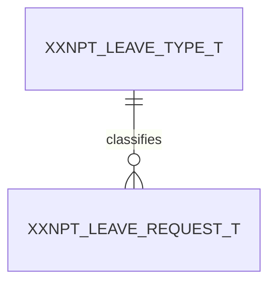

# Schema design document — section contract

The specification `schema-document` writes to. Rules numbered **S1–S22** so a
review can cite one.

---

## Header table

### S1 — Eight facts, before section 1

| Field | Notes |
|---|---|
| **Application** | Name plus a one-line description of what it does |
| **Application Code / ID** | As registered in the app registry. `unassigned` if the platform team has not allocated one — never invent a number |
| **Target engine** | `Oracle 19c+`, `Oracle 23ai`. The version gates real choices (native `BOOLEAN`, identity columns) |
| **Object prefix** | e.g. `XXNPT` |
| **History-table mode** | `ON` (`_H` shadow tables) or `OFF` (WHO columns only). Stated because it changes every table's shape |
| **DDL appendix** | Included / pointer / omitted |
| **Generated** | `dd-Mon-yyyy`. Moves on every edit |
| **Source of truth** | One of the four labels in `SKILL.md`. **In the table, not a footnote** |

---

## 1. Naming legend

### S2 — The suffix contract, as a table

| Object | Suffix | Example |
|---|---|---|
| Table | `_T` | `XXNPT_LEAVE_REQUEST_T` |
| Sequence | `_SEQ` | `XXNPT_LEAVE_REQUEST_SEQ` |
| Trigger | `_TRG` | `XXNPT_LEAVE_REQUEST_BIU_TRG` |
| View | `_V` | `XXNPT_LEAVE_BALANCE_V` |
| Primary key | `_PK` | `XXNPT_LEAVE_REQUEST_PK` |
| Unique constraint | `_UK` | `XXNPT_LEAVE_REQUEST_UK` |
| Foreign key | `_FK` | `XXNPT_LEAVE_REQ_TYPE_FK` |
| Check constraint | `_CK` | `XXNPT_LEAVE_REQUEST_ACT_CK` |
| Index | `_IDX` | `XXNPT_LEAVE_REQUEST_EMP_IDX` |

### S3 — Three conventions stated explicitly

- **Flags.** The house choice and its type: `CHAR(1)` with `CHECK IN ('Y','N')`,
  or native `BOOLEAN` on 23ai+. State it once. (`BOOLEAN` cannot be indexed on
  23ai — if the flag will ever be a filter predicate needing an index, `CHAR(1)`
  is the safer choice even there.)
- **Reserved-word avoidance.** List the words no column is named — `NAME`,
  `STATUS`, `TYPE`, `DATE`, `VALUE`, `COMMENT`, `GROUP`, `ORDER`, `USER`,
  `LEVEL`, `VERSION` — and show the qualified forms used instead
  (`LEAVE_STATUS_CODE`, `OBJECT_VERSION_NUMBER`).
- **Abbreviations.** A table of every one used, with its expansion. `ASMT`,
  `QSTN`, `ATMPT`, `ASGN`, `REQ`. Oracle's 128-character identifier limit means
  these are readability choices, not necessities — which is exactly why they need
  a glossary. An unglossed abbreviation gets a second spelling within a month.

### S4 — Identifier case is declared, once

Oracle folds every unquoted identifier to uppercase in the dictionary, so source
case has no runtime effect. It has a large readability effect: a codebase mixing
`create table xxnpt_leave_t` with `CREATE TABLE XXNPT_ASSET_T` reads as two eras
of tooling. Declare the style and hold it. Dictionary-query contexts
(`schema-audit`) are always uppercase and that is unavoidable.

---

## 2. Audit ("WHO") columns

### S5 — Stated once, present everywhere, drawn nowhere

The exact set, as a table with type, nullability and default. The house set:

| Column | Type | Null | Default | Purpose |
|---|---|---|---|---|
| `CREATED_BY` | `VARCHAR2(n)` | NOT NULL | — | Who inserted |
| `CREATION_DATE` | `DATE` \| `TIMESTAMP WITH TIME ZONE` | NOT NULL | `SYSDATE` \| `SYSTIMESTAMP` | When |
| `LAST_UPDATED_BY` | `VARCHAR2(n)` | NOT NULL | — | Who last updated |
| `LAST_UPDATE_DATE` | `DATE` \| `TIMESTAMP WITH TIME ZONE` | NOT NULL | `SYSDATE` \| `SYSTIMESTAMP` | When |
| `OBJECT_VERSION_NUMBER` | `NUMBER(10)` | NOT NULL | `1` | Optimistic-lock counter |

State three things beyond the table:

1. **Where `CREATED_BY` comes from** — the resolved session identity, never a
   request-body field. Its width follows what it actually stores (`schema-model`
   §5), not a round number.
2. **Whether `ACTIVE_FLAG` is part of the set** or separate. Convention: on every
   *business* table, positive form, never `IS_DELETED`.
3. **That these columns are omitted from every ER diagram in §4** for
   readability, and are present on every table including lookups and junctions.

Saying the third thing matters: a reader who notices `CREATION_DATE` missing from
a diagram otherwise assumes the table lacks it.

---

## 3. Executive summary

### S6 — Six facts, as bullets

1. **Table counts by class** — "34 tables: 22 business, 9 lookup, 3 junction",
   plus externally-owned tables referenced but not designed here.
2. **The domains**, named — they become §4's sub-diagrams and §5's grouping.
3. **Derived, not stored** — S7.
4. **Denormalizations**, each with its evidence — S8.
5. **Volume and partitioning** — per table or per class, with the threshold used.
   "All Low (<100K rows), no partitioning" is a complete answer for a curated
   dataset; say it rather than leaving it inferred.
6. **Sensitivity** — which tables hold PII or credentials, and which merely
   reference a table that does. A schema that references an employee master by id
   is meaningfully different from one that copies email addresses into itself.

### S7 — The derived-not-stored list is enumerated, not summarised

Every count, total, percentage, score, progress figure and computed status the
application shows and the schema does not store. By name, as the UI calls it:

```
moduleCount, caseCount, processCount   -- counted at query time
Days Requested, Balance After          -- computed from dates, holidays, entitlement
assignment progress %                  -- reviewed cases / active cases
module assessment status                -- derived from assessment existence + state
```

"Counts are derived" is not this list. The value is in the names, because the
next developer searching for `case_count` needs to find the reason it is absent.

### S8 — Every denormalization carries its evidence

A stored copy of derivable data needs a stated reason: a counter with no
per-event table behind it, a cached teaser that avoids loading a CLOB for list
rendering. "For performance" is not evidence — evidence is the query that would
otherwise be slow.

An undocumented denormalization is indistinguishable from a mistake, and gets
"fixed" by someone who assumes it was one.

---

## 4. ER diagrams

### S9 — 4.0 full schema, then per-domain above 15 tables

Above the threshold, 4.0 is **relationships only** — no column blocks — and each
domain gets its own sub-diagram **with** column blocks. Below it, one diagram
with columns.



### S10 — Diagram conventions

- Cardinality on every edge: `||--o{`, `||--||`, `||--o|`, `}o--o{`.
- A quoted verb phrase on every edge. `"classifies"` reads; a bare line does not.
- Externally-owned tables appear with their real names (`XXINT_EMPLOYEE_MASTER_T`)
  so a reader can see the boundary.
- **A cross-schema relationship drawn here must appear in §6 marked
  `app-enforced, no DB constraint`.** A diagram edge implies a constraint;
  where there is none, §6 is the only place that says so.
- WHO columns and `ACTIVE_FLAG` omitted, per S5.

---

## 5. Table catalog

### S11 — Column order is fixed

Surrogate PK → business/natural keys → business data → FK columns → lookup/code
columns → WHO columns (+ `ACTIVE_FLAG`).

Consistent order across 30 tables is what lets a reviewer scan for the FK block
and see at a glance that one is missing.

### S12 — Per-table required content

- **Purpose** — one line, what a row *is*. "A single leave request raised by an
  employee", not "leave request table".
- **Column table** — `Column | Type | Null | Key | Default | Notes`. Every
  column. WHO columns may collapse to one `WHO ×5 — see §2` row.
- **Indexes** — including the mandatory FK-support indexes.
- **Relationships** — parent of / child of, in words.
- **Denormalizations** — named here as well as §3, if the table has any.
- **Volume** — if it differs from the §3 default.

### S13 — Type precision is part of the type

`VARCHAR2(240)` not `VARCHAR2`. `NUMBER(5,2)` not `NUMBER` when scale matters —
a leave balance of `12.5` days needs the scale, and `NUMBER` silently permits
`12.499999`. For `VARCHAR2`, state `CHAR` semantics where multi-byte content is
expected.

### S14 — Assumptions are referenced, not repeated

Where a column exists because of an assumption, cite it: `(A-3)`. Restating the
assumption in the catalog creates two versions that drift.

### S15 — FK indexes are listed, because Oracle does not create them

Oracle indexes a primary key automatically and a foreign key **never**. An
unindexed FK means a full scan on every parent-side join and a table-level lock
on parent deletes.

The one legitimate exception: the FK column is already the **leading** column of
an existing `UNIQUE`/`PK` index. Name that index in the exception.

---

## 6. Relationship matrix

### S16 — Six columns, one row per relationship, no exceptions

| Parent | Child | Cardinality | FK column | ON DELETE | Rationale |
|---|---|---|---|---|---|
| `XXNPT_LEAVE_TYPE_T` | `XXNPT_LEAVE_REQUEST_T` | 1:N | `LEAVE_TYPE_ID` | RESTRICT | Lookup integrity — a type in use cannot vanish |
| `XXNPT_LEAVE_REQUEST_T` | `XXNPT_LEAVE_REQUEST_DAY_T` | 1:N | `LEAVE_REQUEST_ID` | CASCADE | Day rows have no meaning without their request |
| `XXINT_EMPLOYEE_MASTER_T` | `XXNPT_LEAVE_REQUEST_T` | 1:N | `EMPLOYEE_ID` | app-enforced, no DB constraint | Parent is in XXINT; only SELECT is granted |

### S17 — The rationale column is mandatory and substantive

Blank, `Standard`, `Default`, `N/A` — all review failures. The test: would this
sentence settle an argument about whether `CASCADE` is right? *"Day rows have no
meaning without their request"* settles it. *"Standard"* does not.

### S18 — Every FK in §5 appears here, and every row here in §5

The two sections are one fact in two views. Divergence is the most common defect
in a hand-maintained schema document, and it is mechanically checkable.

---

## 7. Lookup / reference seed data

### S19 — Actual codes, actual meanings

One small table per lookup, with the real rows:

```
XXNPT_LEAVE_STATUS
| CODE     | MEANING   | TAG | ENABLE_FLAG |
| DRAFT    | Draft     | 10  | Y           |
| PENDING  | Pending   | 20  | Y           |
| APPROVED | Approved  | 30  | Y           |
| REJECTED | Rejected  | 40  | Y           |
```

"Statuses as required by the business" is not seed data. These codes end up in
application `if` statements, so an unlisted code is an unimplemented branch.

State the **ordering mechanism** — a display-order/tag column, or alphabetical —
because a UI dropdown ordered by insertion is a defect someone will file.

### S20 — Centralized lookups are declared as such

Where lookups live in a shared, application-scoped lookup table rather than
per-lookup tables, say so, and give the discriminator (`application_id`,
`lookup_type`). Then §7 lists the `lookup_type` values and their codes, and §5
does **not** invent per-status tables. Getting this wrong produces a schema with
nine status tables shadowing a lookup framework that already exists.

---

## 8–12

### S21 — Sections 8, 10, 11 and 12

- **§8 Cross-cutting conventions** — optimistic locking (the `WHERE
  OBJECT_VERSION_NUMBER = :expected` discipline and what a zero-row update
  means), soft delete (and how exclusion is enforced consistently — a view, or a
  lint-enforced predicate), identity strategy (identity columns vs sequence +
  trigger, picked per table and stated), timestamp types (event columns vs
  calendar columns), history tables on/off.
- **§10 Assumptions & open questions** — numbered `A-1`…, each with what was
  assumed, why, and what would change if it is wrong. An open question names who
  can answer it.
- **§11 Coverage report** — which requirements this schema serves and which it
  does not yet. The uncovered list is the section's whole value; a coverage
  report claiming 100% is usually a report that stopped looking.
- **§12 DDL appendix** — the emitted DDL, or a pointer to the scripts. Include
  the migration-history registration, so the change is versioned rather than
  something someone ran once from a terminal.

### S22 — §9 traceability map is generated

From `docs/traceability.json`, by `sdlc-core:doc-coherence`. Table → the PRD unit
ids that read or write it. Hand-editing is drift; regenerate.

The reverse direction is the useful one and the checker enforces it: a prefixed
table in §5 that no unit claims is `ORPHAN-TABLE` — either a screen is missing
from the PRD, or the table is.
