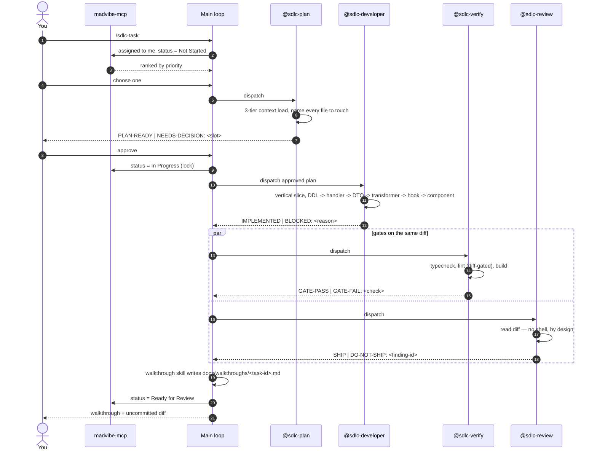

# AI-First SDLC Automation — React, Flutter, Oracle/ORDS

> **Version:** 4.0.0 · **Date:** 2026-07-29 · **Status:** Design. No plugin files created yet.
> **Scope:** All projects under `D:\Madhan_Projects`
> **Evidence base:** 10 researched dimensions, 6 adversarial audits, 2,088,393 subagent tokens. Every version here was read off a registry page; every repo claim was checked against the file on disk.

---

## 0. DO FIRST — before any of this gets built

These are ordered by consequence, not by how interesting they are. Items 1–2 are security.

1. **Rotate both ORDS accounts** (`XXMGNT`, `MOBILEDEVNALSOFT`). Their passwords are hardcoded in [scripts/switch-env.cjs](../../Madhan_Projects/nalsoft-crm-git/scripts/switch-env.cjs) lines 88–94, which is **tracked in git** and committed in `d1b6cd1`. Rotation is the fix; history rewriting is not, because anything already pushed is already disclosed.
2. **Stop shipping the credential to the browser.** [config.ts:13-14](../../Madhan_Projects/nalsoft-crm-git/src/api/client/config.ts#L13-L14) reads `import.meta.env.VITE_API_PASSWORD`, and Vite **inlines `VITE_*` at build time** — the literal is present in `dist/assets/index-C3-flOao.js` right now. Move Basic auth to an nginx `proxy_set_header`, sourced from a Docker secret at container start, and delete both vars from the tree. A runtime `window.__ENV__` does not fix this; it relocates it.
3. **`axios` → 1.18.1.** The installed 1.13.3 carries 12 HIGH advisories, including full MITM via `config.proxy` prototype pollution (CVSS 8.7) and a DoS via `__proto__` in `mergeConfig` that affects `<=1.13.4`.
4. **`vite` → 6.4.3+.** Clears a dev-server arbitrary file read, a `server.fs.deny` **Windows-specific** bypass, an optimized-deps path traversal, and an NTLMv2 hash disclosure via launch-editor.
5. **Run `npx tsc --noEmit` once and write down the number.** The repo has never type-checked: there is no `typecheck` script and `build` is bare `vite build`, which is esbuild transpile-only. If the count is not 0, the next deliverable is making it 0 — not adding strict flags.
6. **Delete the wrangler/Hono deadwood** and its four npm scripts. If something breaks, the "Cloudflare path is dead" assumption was wrong and you found out for free.
7. **Add `xx-audit-invalid.sql` after every PL/SQL deploy.** One query. Currently missing from every schema.

Nothing in §5 onwards is worth building before 1–3 are done.

---

## 1. What this is

Human-triggered, agent-assisted delivery across three stacks, plus a scaffolding path for new projects. You tag work with a task; the pipeline plans, implements, gates itself on build quality and security, and returns a written walkthrough. Scaffolding runs on proven substrate rather than improvised generation.

### 1.1 Non-goals

| Not in scope | Why |
|---|---|
| Autonomous polling, unattended overnight runs | You trigger each task (D1). |
| Deploy on green | Deployment is human-invoked. |
| Mutating git operations by any agent | D5. Read-only `git status`/`diff` permitted. |
| Local iOS builds | Impossible on win32. Needs a macOS runner that does not exist yet. |
| Behavioural tests as a React gate | Accepted gap (D2). Flutter is held higher — see §6.4. |
| Parallel task execution | Follows from having no branch isolation (D5). |
| A live dependency on any marketplace | Curated vendoring instead (D7). |

---

## 2. Design principles

Three rules decide every structural question here.

### 2.1 A subagent is a context firewall, not a personality

Evidence: an engineer who built 100 Claude Code subagents kept 12. The other 88 failed on **description collisions** (router picks wrong or nothing), **context blowback** (an agent dumping its transcript back into the main conversation re-floods the space it exists to protect), **persona tax** (verbose "you are an elite expert" preambles burning tokens before any work), and **title-driven design** (agents named after job titles rarely trigger).

Measured against the largest public collection: 204 agents, median body **7,034 chars**, and only **7.8% declare a `tools` allowlist** — meaning their `code-reviewer` inherits `Write` and `Edit`. A reviewer that can edit is a defect. Anthropic's official example is **24 lines**.

Consequences enforced throughout: agents exist only where they isolate verbose or expensive context; bodies target **2.5–4 KB**; procedure lives in skills and is *referenced*, never pasted; every agent declares `tools` explicitly, never `*`; skill descriptions use non-overlapping trigger verbs.

### 2.2 Deterministic substrate, generated adaptation

Anything with a correct, versioned, community-tested implementation is invoked, not regenerated. The agent layer does what genuinely needs judgement: reading the task, choosing skills, adapting to your conventions, explaining what changed.

### 2.3 One source of truth per fact

`AGENTS.md` owns rules; `CLAUDE.md`/`GEMINI.md` are pointers. `llmwiki/` owns synthesized architecture. `pubspec.yaml`/`package.json` own versions. Bootstrap skills *generate* `AGENTS.md` and `llmwiki/`; implement skills *read* them. Neither restates the other.

**Corollary applied to this document:** the 3-Tier context protocol is **not** restated here. It lives in `AGENTS.md` and `llmwiki/index.md`. Two verified facts belong with it: `code-review-graph` 2.3.2 **does** parse Dart (`.dart` → classes, mixins, enums, function signatures, imports), so Tier 1 works for Flutter; `graphify`'s Dart coverage is **unverified** and must be confirmed by running `graphify update` on `naqleen-otm-mobile` before Tier 2 is trusted there.

---

## 3. Decisions of record

| # | Decision | Rationale |
|---|---|---|
| D1 | Human-triggered per task; terminal state is a walkthrough for review. | You are the only meaningful checkpoint while React has no behavioural tests. |
| D2 | React gate = typecheck + lint + build. Flutter gate additionally runs `flutter test`. | Honest about each substrate. A gate that cannot fail is worse than none. |
| D3 | Generate all three IDE surfaces — `.agent/`, `.claude/`, `.codex/`. | You use Antigravity and Claude Code actively. Drift handled by generation (§8). |
| D4 | Per-agent skill rosters in `skills:` frontmatter. | It preloads skill *content* into subagent context — the mechanism that keeps bodies under 4 KB while five plugins share one convention source. |
| D5 | No mutating git operations by any agent. | Your decision. Consequence: strictly serial execution (§7.5). |
| D6 | Canonical doc: `D:\Madhan_Utils\docs\sdlc-automation.md`. | Governs all projects; belongs in no single product repo. |
| D7 | Curate and vendor; no live upstream dependency. | Full control, no upstream breakage. Cost: no upstream fixes — mitigated by recorded SHAs (§9.1). |
| D8 | Deterministic substrate for scaffolding. | Proven beats generated. |
| D9 | **4 agents total**, all with explicit `tools`. | §2.1. |
| D10 | **ESLint 9.39.5 + TypeScript 5.9.3.** Not ESLint 10, not TS 6/7. | `eslint-plugin-jsx-a11y` peers cap at `^9`, so ESLint 10 silently deletes a11y linting. TS 7 ships no programmatic API and typescript-eslint closed support as `not_planned`. The ESLint 9 config is the one that was actually **installed and executed** against 307 files. |
| D11 | **`react-router` 7.18.2** on the CRM, renamed off `react-router-dom`. | `react-router@8.3.0` peers `react >=19.2.7` **plus** Node ≥22.22 **plus** Vite 7+ and is ESM-only — adopting it force-cascades a four-part migration. 7.18.2 shipped six days after 8.3.0; the line is maintained. |
| D12 | **Identity is resolved server-side from the session token.** Any user field in a request payload is advisory and must be re-derived. | The alternative is a spoofable-identity rule. Also rules out `X-USER` headers and `SYS_CONTEXT` — under a pooled ORDS connection the latter returns the proxy user, not the end user. |
| D13 | **Ship order: v1 = `sdlc-core` + `react-sdlc`. v1.5 = `schema-architect` + `api-architect`. v2 = `flutter-sdlc`.** | Five plugins × 4 skills × ~40 vendored artifacts maintained by one person under a no-upstream rule is not shippable in one pass. |

### 3.1 Accepted risks

- **No React behavioural regression detection** (D2). Compensating control: mandatory manual verification steps in every walkthrough (§7.4).
- **No rollback point created by the pipeline** (D5). The working tree is the only artifact.
- **Strictly serial execution.** Two tasks in one working tree with no branch isolation interleave indistinguishably at review time.
- **No upstream fixes** (D7). Vendored files are frozen at copy time.
- **Docker+nginx is assumed live; wrangler assumed dead.** This is an assumption, not a verified fact — 100% of npm scripts are wrangler/Hono while the Docker path has none. §0 item 6 is how you test it cheaply.

---

## 4. Pipeline



**Why four agents and not three:** the Bash split. `@sdlc-verify` needs a shell. `@sdlc-review` must **not** have one, or it will "review" by running things instead of reading the diff.

Gates run in parallel against the same diff. Chaining them means a security finding cannot surface until the build is green — slower, and it hides one class of problem behind another.

---

## 5. The five plugins

```
D:\Madhan_Utils\sdlc-plugins\        ← canonical source, local marketplace
├── .claude-plugin/marketplace.json
├── sdlc-core/        agents ×4 · skills ×5 · walkthrough · madvibe-task-sync
├── react-sdlc/       scaffold · slice · gate · release
├── flutter-sdlc/     scaffold · slice · gate · release
├── schema-architect/ model · emit-ddl · audit · promote
└── api-architect/    contract · emit-handler · audit · publish
```

Install per project via `/plugin marketplace add`, then generate the three IDE surfaces (§8). One copy maintained.

### 5.1 `sdlc-core` — 4 agents + 5 shared skills

Shared skills are referenced through `skills:` frontmatter, never pasted into agent bodies.

| Skill | Verb | Contents |
|---|---|---|
| `evidence-contract` | **attest** | What counts as proof: a command's exit code *and* output, a `file:line`, or a fetched URL. Mandatory inline `ASSUMPTION:` prefix for anything not directly observed. Bans footnote-collected uncertainty. |
| `output-contracts` | **emit** | The four literal output templates and their forced terminal tokens. |
| `arbitration` | **arbitrate** | What happens when two plugins disagree. Conflicts escalate to you; they are never silently resolved by whichever agent ran second. Writes `docs/decisions/`. |
| `vendoring-freshness` | **refresh** | Header format `# vendored <pkg>@<ver> on <date>` + upstream URL + license obligation. `tools/check-vendored-freshness` **prints, never blocks**. |
| `secret-scan` | **scan** | Patterns for `VITE_*` credentials, `.env`, `*.conf`, **and `*.sql`** (`jwt-sign-function.sql`, `fcm-java-signer.sql`). Blocking. |

### 5.2 The four agents

Plugin subagents **ignore** `permissionMode`, `mcpServers`, and `hooks`. The `tools:` allowlist is the only enforcement — never omitted, never `*`.

| Agent | `tools` | Terminal token |
|---|---|---|
| `sdlc-plan` | Read, Grep, Glob, WebFetch | `PLAN-READY` \| `NEEDS-DECISION: <slot>` |
| **`sdlc-developer`** | Read, Write, Edit, Grep, Glob, Bash | `IMPLEMENTED` \| `BLOCKED: <reason>` |
| `sdlc-verify` | Read, Grep, Glob, Bash | `GATE-PASS` \| `GATE-FAIL: <check>` |
| `sdlc-review` | Read, Grep, Glob, ReportFindings | `SHIP` \| `DO-NOT-SHIP: <finding-id>` |

`model: inherit` on all four. **Do not downgrade `sdlc-verify`** — it parses compiler and analyzer output, where a cheap model silently mis-summarises failures into passes.

`description` is dispatcher copy, not human copy: third person, one "Use PROACTIVELY when…" clause, one explicit negative, and trigger nouns spanning all five plugins (React, Vite, Flutter, Dart, PL/SQL, ORDS).

**Body — six sections, identical skeleton, 2.5–4 KB:**

1. **ROLE** — 1–2 sentences, second person, no preamble.
2. **NON-NEGOTIABLES** — 3–6 prohibitions. *"Never state a command passed without quoting its exit code."*
3. **PROCEDURE** — numbered, 5–9 steps, each naming an exact command or file. **Prose paragraphs banned here** — this is the section that actually gets followed.
4. **EVIDENCE RULES** — per `evidence-contract`.
5. **OUTPUT CONTRACT** — literal template ending in one uppercase token on its own final line. `sdlc-verify` must quote **all three gate exit codes verbatim**.
6. **STOP CONDITIONS** — return control when a decision is missing, a file is unreadable, or a gate command is absent.

Agents are sequenced by the *skill*. Never write a body that assumes one agent can dispatch another.

### 5.3 `react-sdlc`

| Skill | Verb | Contents |
|---|---|---|
| `react-bootstrap` | **scaffold** | Emits the §6.1 tree, both version profiles, `eslint.config.js`, `tsconfig.json`, scripts, Dockerfile, nginx (**including the ORDS auth proxy**), entrypoint, CI, `gate.ps1`. Branches the router pin on the React major. |
| `react-slice` | **slice** | **The vertical seam, end to end** — the most-used skill and the one no dimension originally owned. Adding a field = DDL → engine `apex_json.write` → handler → `*-dto.types.ts` → `*.transformers.ts` → `queryOptions` → mutation hook owning its own invalidation → component. Threads `{ signal }`. Writes the walkthrough. |
| `react-verify` | **gate** | `tsc --noEmit` (12s) + `eslint <diff>` (24s full-repo) + `vite build` (12s) = **48s measured**. Diff-gated at full strength. Weekly full-repo report. Strict-flag ladder adopted one flag at a time with a stated acceptance criterion. |
| `react-ship` | **release** | Build ARG for `base`; sha-tagged image **plus** `:latest`; push; ssh + `docker run`; post-deploy smoke check; previous SHA recorded for rollback. **Refuses to run until the five unverified container behaviours in §10.2 are confirmed once.** |

### 5.4 `flutter-sdlc` (v2)

| Skill | Verb | Contents |
|---|---|---|
| `flutter-bootstrap` | **scaffold** | `flutter create` + a vendored `lib/` overlay. Emits `bootstrap.dart`, 3 flavor entrypoints, strict `analysis_options.yaml` **and** a `.brownfield.yaml`, `build.yaml`, `tools/`. |
| `flutter-slice` | **slice** | Service → abstract Repository returning `Result<T>` → Cubit with freezed sealed state → Screen with exhaustive `switch`. DTO/domain split via `field_rename: snake`. Repository mandatory for **new** features only. |
| `flutter-verify` | **gate** | **Blocking:** `flutter analyze --fatal-infos` + `dart run tools/check_boundaries.dart` + `flutter test`. **Advisory:** `bloc lint`, coverage ratchet. |
| `flutter-ship` | **release** | Android flavors + `key.properties` signing (**never committed**), `--dart-define-from-file`, obfuscation + symbol upload, versionCode strategy. **iOS is a documented stub.** This is the thinnest skill in the set — every CI version in it is unverified (§10.2). |

### 5.5 `schema-architect` (v1.5)

| Skill | Verb | Contents |
|---|---|---|
| `schema-model` | **model** | 9-step feature-request → DDL procedure, relationship matrix with per-FK `ON DELETE` rationale, and the FK-indexing step. |
| `schema-emit` | **emit-ddl** | Business / junction / lookup-seed templates in house style. Idempotent, self-registering in the changelog. `CACHE 20 NOORDER`. `GENERATED BY DEFAULT ON NULL`. |
| `schema-audit` | **audit** | `xx-audit-conventions.sql`, `xx-audit-sequences.sql`, `xx-audit-lookups.sql`, `xx-audit-invalid.sql`. Every query returns violations only — empty output means pass. |
| `schema-promote` | **promote** | XXINT → XXMGNT: apply order, `AUTHID` declaration, grants **without** `WHEN OTHERS THEN NULL`, recompile order for cross-schema dependencies, invalid-object check, and a rollback policy by change class (additive: none · drop: pre-drop CTAS with a retention date · backfill: keyed before-image table · package: `git checkout <sha> -- file && @file`). |

### 5.6 `api-architect` (v1.5)

| Skill | Verb | Contents |
|---|---|---|
| `api-contract` | **contract** | `ORDS-HOUSE-CONTRACT.md` — rules A1–A14 as a reviewable checklist, plus the status-code map. Note 404/409/422 are a **proposal**, not an extraction from existing handlers. |
| `api-emit` | **emit-handler** | Handler template (GET collection / GET by id / POST save) with `:status_code`; engine-procedure template showing where validation lives and how business rules are rejected; `DBMS_APPLICATION_INFO` at the top. |
| `api-audit` | **audit** | `xx-audit-ords-drift.sql` — diffs `USER_ORDS_TEMPLATES` + `USER_ORDS_HANDLERS` across schemas. Enumerates package-global variables in the engine packages (a pooled-session leak vector). |
| `api-publish` | **publish** | `ORDS.DELETE_MODULE` → `ORDS.DEFINE_MODULE` under a **parameterised** schema alias → `ORDS.ENABLE_SCHEMA` → drift audit → `.http` smoke run. Enforces file-is-truth. |

---

## 6. The stacks

### 6.1 React

Two profiles. **Greenfield** takes latest; **adopt-in-place** pins to the CRM's existing majors so the plugin never triggers a migration wave as a side effect.

| Slot | Greenfield | Adopt-in-place (CRM) |
|---|---|---|
| react / react-dom | 19.2.8 | **18.3.1 — keep** |
| vite | 8.1.5 | **6.4.3+** (security) |
| typescript | 5.9.3 | **5.9.3 — keep, pin exactly** |
| router | react-router 8.3.0 | **react-router 7.18.2** (D11) |
| server state | @tanstack/react-query 5.101.4 | 5.101.4 (declared floor drifted ~73 minors) |
| client state | zustand 5.0.14 | 5.0.14 — verified safe: **0** object-literal and **0** array-literal selectors |
| http | axios 1.18.1 | **1.18.1** (security) |
| styling | tailwindcss 3.4.19 | **3.4.19 — keep** |
| lint | eslint 9.39.5 · typescript-eslint 8.65.0 · import-x 4.17.1 · jsx-a11y 6.10.2 · react-hooks 7.1.1 · react-refresh 0.5.3 · @tanstack/eslint-plugin-query 5.101.4 | same — net-new, repo has zero lint tooling |
| format | prettier 3.9.6 + eslint-config-prettier 10.1.8 | same. **Not in the gate** — formatting is not a defect class |
| test | vitest 4.1.10 + RTL 16.3.2 (**unexecuted**, §10.2) | **none — keep** |
| forms | **UNRESOLVED — no pin** (§10.4) | — |

Two traps worth naming: `@eslint/js` npm `latest` is **10.0.1** and must be hand-pinned to 9.39.5; and `@tanstack/eslint-plugin-query`'s flat config is an **Array**, so it is spread, not nested.

### 6.2 Flutter

**Keep `flutter_bloc`.** Google's official guidance (`docs.flutter.dev/app-architecture`) endorses **neither** bloc nor Riverpod — it prescribes MVVM with a repository layer and a `Command` object, and its reference app uses `provider` for DI. Anyone claiming Google recommends either is wrong. Bloc satisfies the prescribed layering exactly as well as Riverpod, `naqleen-otm-mobile` already uses it, and `bloc_test` gives a falsifiable assertion per transition — which matters because Flutter is where the testing budget is spent.

Changes vs `naqleen-otm-mobile`: add `very_good_analysis` 10.3.0 (**required** — this is the Flutter half of the gate), `sentry_flutter` 9.25.0 (**required** — field crashes are invisible today), `bloc_test` + `mocktail` with a coverage floor on `bloc/` and `services/` only, `osv-scanner` + `gitleaks`. `go_router` 16 → 17.3.0 is **recommended**, as its own ticket.

**Dart has no equivalent of `import/no-restricted-paths`.** The React architectural-enforcement thesis does not port. Enforcement is a ~20-line `tools/check_boundaries.dart`, not an analyzer plugin — see the cut list.

### 6.3 Backend — Oracle + ORDS

The conventions already exist in your estate; the plugins codify and enforce them rather than invent them. Extracted from [XXUCL-schema-design.md](../../Madhan_Projects/use-cases-git/db-scripts/XXUCL-schema-design.md), the two newest DDL files, and both ORDS handler modules.

**Schema:** object suffixes `_T`/`_SEQ`/`_TRG`/`_PK`/`_UK`/`_FK`/`_CK`/`_IDX`. A **5-column** WHO set — `CREATED_BY`, `CREATION_DATE`, `LAST_UPDATED_BY`, `LAST_UPDATE_DATE`, `OBJECT_VERSION_NUMBER` (`LAST_UPDATE_LOGIN` deliberately dropped, `VERSION_NUMBER` renamed). `CHAR(1)` `Y`/`N` flags, never `NUMBER(1)`. Positive-form soft delete via `ACTIVE_FLAG`, never `IS_DELETED`. Reserved words qualified. Sequence + trigger for PK population.

**API:** plural collection paths, `:id` path params, `/save` POST endpoints, `/form-meta` metadata endpoints, snake_case JSON, `source_type_plsql` handlers over PL/SQL package procedures, `page_number`/`total_count` pagination, business-rule rejections as terminal 4xx (the client sets `retry: false`).

**Drift each plugin must catch:** `CREATED_BY` width disagreement (design doc says 100, the two newest DDL files ship 64 — both in production, §10.4), sequence mismatches between XXINT and XXMGNT, per-module lookup tables that should now be `XXCUST_LOOKUP_VALUES_T` keyed by `APPLICATION_ID`, and ORDS template/handler divergence across schemas.

**PL/SQL testing: codify the existing `assert`/`ORA-20999` idiom. Do not adopt utPLSQL** — it needs a DBA-installed `UT3` schema plus cross-schema grants, likely unobtainable on the managed OCI instance.

### 6.4 The gate, per stack

**React:** `npx tsc --noEmit` · `npx eslint <diff>` · `npm run build`.
**Flutter:** `flutter analyze --fatal-infos` · `dart run tools/check_boundaries.dart` · `flutter test`.

**Prohibited:** reporting a gate as passing when the command did not execute. A skipped gate is `NOT RUN`. This is the most important rule in the document.

Flutter is held to a higher standard than React because its substrate provides tests cheaply. That is a consequence of the substrate, not an inconsistency.

---

## 7. Mechanisms

### 7.1 Skill Decision Record

`@sdlc-plan`'s first output, before reading source. Records task class, size, stack, stage; the candidates surveyed with **rejection reasons**; the selection; and any `Unmet need`.

Rejection reasons are the debuggable part — when selection goes wrong you can see which alternative was dismissed and why. Repeated `Unmet need` entries are the trigger to author a new skill.

### 7.2 Bounded loops and summary-only returns

`@sdlc-verify` gets **2 auto-fix cycles**, then stops with the verbatim failing lines. `@sdlc-review` is read-only and gets 0. After a security fix both gates re-run **once**, and that re-run does not consume a verify cycle. If the fix breaks the build, the walkthrough goes RED with both facts stated — the fix is not reverted to manufacture green. **Total gate executions per task: 4.**

Agents return a verdict, a count, and the failing lines. Never full logs. An agent that returns 400 lines of `tsc` output has defeated its own purpose.

### 7.3 Evidence contract

No claim without its evidence inline: exit code *and* output, or `file:line`, or a fetched URL. Anything else carries a literal `ASSUMPTION:` prefix at the point of use. Uncertainty collected in a footnote at the end does not count — this design was itself nearly derailed by dimensions carrying 8–15 self-declared unverified items apiece, several of them load-bearing.

### 7.4 Walkthrough

`docs/walkthroughs/<task-id>.md`: status, what changed and why, files touched with blast radius from `code-review-graph`, gate results as a table plus verbatim failures, security findings with severity and `file:line`, **manual verification steps** (mandatory, non-empty — the compensating control for D2), open items, and **Not done** (mandatory — silence about omitted scope reads as completion).

### 7.5 Serial execution and locking

One task in flight; before starting, check for an unfinished walkthrough and for a madvibe task already `In Progress`. madvibe status is the lock: `Not Started` → `In Progress` on plan approval → `Ready for Review` on walkthrough, or `Blocked` on an exhausted gate.

---

## 8. Multi-harness distribution

Canonical source is `sdlc-plugins/`. A generator emits `.claude/`, `.agent/`, and `.codex/` from it.

| Step | Action | Failure mode |
|---|---|---|
| 1 | Parse all agent frontmatter | Malformed → abort, name the file |
| 2 | Resolve every `skills:` entry | Unresolved → **abort, naming agent and skill** |
| 3–4 | Emit agents and `<name>/SKILL.md` skills to all three surfaces | — |
| 5 | Delete flat `.md` files directly under `.claude/skills/` | Removes the four inert files that never loaded |
| 6 | Report counts and any skill present in only one surface | — |

Step 2 is what turns per-agent rosters from a convention into an invariant. It is what catches the dangling `vulnerability-scanner` and `red-team-tactics` references in the existing `security-auditor.md`.

**Prune `.agent/agents/` from 20 to 4.** Keep `security-auditor` (repaired: drop the two dangling skills, remove `Edit`/`Write` from a declared read-only agent, add the output contract) and replace the rest. Deleted capability relocates: `debugger` → `systematic-debugging` skill · `explorer-agent` → Claude Code's built-in `Explore` · `frontend-specialist`/`mobile-developer` → the `*-slice` skills · `qa-automation-engineer`/`test-engineer` → `@sdlc-verify` · `devops-engineer` → `*-ship` · `documentation-writer` → `walkthrough`. `game-developer` and `seo-specialist` in a CRM repo relocate to nothing; they are the clearest evidence of bulk-copying.

---

## 9. Curation and provenance

| Source | Take | License |
|---|---|---|
| `wshobson/agents` | Agent structure, the 4-tier model rule, the multi-harness generator pattern. Take the **shape of `operating-kit/code-review-preshipment.md`** (3.1 KB, real tool allowlist, forced SHIP/DO-NOT-SHIP), not the 8–10 KB capability catalogs — those are ~60% résumé. | MIT © 2024 Seth Hobson |
| `alan2207/bulletproof-react` | **Docs only** — folder layout and the `no-restricted-paths` concept. **Never its `package.json`**: the reference app is React 18 / ESLint 8 / `.eslintrc.cjs` / Vite 5 / Tailwind 3, 14 months stale. | MIT © 2024 Alan Alickovic |
| `flutter/website` | Layering guidance, `deployment/android.md` signing key names verbatim. | **CC-BY-3.0 — attribution required in the vendored artifact** |
| `very_good_analysis` | Vendored verbatim as the Dart lint set. | MIT © 2020 VGV |
| `eslint-plugin-check-file`, `patrol` | — | **Apache-2.0 — NOTICE obligation** |
| `rohitg00/awesome-claude-code-toolkit` | Two-gate approval concept only. | **Apache-2.0 — NOTICE + state modifications** |
| `VoltAgent/…subagents` | Description phrasing only. Self-declared unaudited. | MIT © 2025 VoltAgent |
| Local `.codex/skills/` (30 libraries) | Prefer these over external equivalents — already conventioned to your projects. | — |
| `ui-ux-pro-max` (installed) | **All** visual/typography/UX guidance, both stacks. Stage skills delegate here and never restate design rules. | — |

**`VeryGoodOpenSource/very_good_core` has NO license** — `LICENSE` and `LICENSE.md` both 404, archived 2024-02-21. **Do not copy it, even "verbatim as provenance."** Take the equivalent content from `very_good_cli` (MIT) or cite only.

### 9.1 Vendoring rules

Record source commit SHA and retrieval date in a header on every vendored file. Verify the license before copying and retain attribution. **Strip persona preambles** — vendored agents arrive with "you are an elite expert" framing, which is the persona tax. Prefer local over external where both exist.

---

## 10. Cut list

Everything below was considered and deliberately excluded.

**React.** Tailwind 4.3.3 (CSS-first rewrite; no dimension produced a v4 config, so pinning it means a greenfield app with no working styling layer) · React 19 + Vite 8 + Node 22.22 ESM cascade on the CRM (its only forcing function was the mistaken router pin) · ESLint 10 + TS 6/7 (D10) · `sync-eslint-features.mjs` (a `readdirSync()` in the config cannot drift and **removes** a gate command instead of adding a fourth) · `target: './src/features/*'` glob zones (**proven a silent no-op on Windows** — `path.resolve` runs before `isGlob`) · `eslint-plugin-boundaries` · `check-file` KEBAB_CASE on existing files (**measured 206 errors** — mass rename for zero defect-catching value) · type-aware linting at install (roughly doubles a 24s run and overlaps what `tsc` reports free) · `prettier --check` in the gate · TanStack Router, wouter, Framework Mode · Biome/oxlint (neither can run the two rules carrying the dimension) · RTK Query, jotai, valtio, SWR, query-key-factory libraries.

**The OpenAPI codegen pipeline — a round-1 "established fact" that turned out false.** Every handler is `source_type_plsql` with hand-emitted `apex_json`, declares no result set, and there are **zero** `ORDS.DEFINE_PARAMETER` calls in either module. The catalog emits paths and nothing about payloads. Hand-write DTOs, enforce same-commit editing, add a dev-only Zod parse. Parsing ~250 `apex_json.write()` sites across two 8,000-line packages is a bespoke parser with a worse failure mode than hand-writing.

**Oracle.** `NOCACHE ORDER` on new sequences (forces a dictionary update per `NEXTVAL`; all 37 live sequences use `CACHE 20 NOORDER`) · `GENERATED ALWAYS AS IDENTITY` (errors on explicit assignment, and the cross-schema sync procedure necessarily assigns the PK — conformant tables would be unpromotable) · migrating the 37 `_S` sequences to identity columns · renaming `_U1`/`_N1..N9` indexes or fixing `CRATION_DATE`/`MGR_ASSIGNEMENT_ID` (38 + 11 bind sites; `MGR_ASSIGNEMENT_ID` is a PK the sync procedure keys on) · `X-USER` header or `SYS_CONTEXT` identity (D12) · utPLSQL · resource-verb REST, ORDS-native pagination, camelCase, dropping the envelope, OAuth2 (each a rewrite of ~120 handlers for zero user-visible gain, several structurally impossible with `source_type_plsql`) · a global `:status_code` flip (simultaneous breaking change to 17 `*.api.ts` files on a repo whose test suite is `curl localhost:3000` — per-endpoint opt-in instead).

**Flutter.** First-party Dart analyzer plugin — **the worst cost/benefit item found**: pre-1.0, tracks analyzer majors tightly, and it is compiler-adjacent infrastructure to enforce a boundary rule on a codebase with **0 measured cross-feature imports**. Replaced by ~20 lines of Dart · `custom_lint` 0.8.1 and `solid_lints` (objectively broken — pub 60/160 `has:error`, their own `dart analyze` fails) · `golden_toolkit` and `dart_code_metrics` (both discontinued; recommending either in 2026 is a stale-training-data tell) · alchemist goldens + patrol (three testing systems before the first test exists) · `bloc lint` as blocking (a `0.1.0-dev.24` prerelease with unverified exit-code behaviour) · `--min-coverage 100` on a repo with ~0 tests · **wrapping `very_good_cli`** (live upstream dependency, ships as a compiled bundle, unvendorable) · Riverpod 3, Mockito, injectable, auto_route, GetX, signals.

**Deployment.** Entrypoint `sed` over built assets · `VITE_*` at container start · docker-compose/K8s · Cloudflare Pages · Node 20 (EOL 2026-04-30) · committing the keystore or `key.properties` — flutter/website, verbatim: *"Keep the key.properties file private; don't check it into public source control."* A leaked Play upload key can only be reset by Google support.

**Process.** Shipping five plugins in v1 (D13).

---

## 11. Unresolved — needs your decision

### 11.1 Blocking judgement calls

1. **Forms stack.** `react-hook-form` + `zod` are prescribed by bulletproof-react and researched by **nobody** — zero verified versions, zero templates, on a CRM whose surface is mostly forms and which already has server-side `/form-meta` endpoints. **`react-bootstrap` cannot emit a complete greenfield app until this closes.**
2. **`xlsx@0.18.5` — 2 HIGH, unfixable via npm.** SheetJS left the registry; patched builds live only on `cdn.sheetjs.com`. Options: point npm at the SheetJS registry, swap to `exceljs`, or accept and document. No dimension raised this.
3. **`CREATED_BY` width — 64 or 100?** Design doc says 100; the two newest DDL files ship 64. Both in production. The audit rule depends on the answer.
4. **`AUTHID` — definer or invoker rights?** Never mentioned by any dimension. It changes which grants are required and disables roles inside definer-rights PL/SQL. Must be settled before `schema-promote`.
5. **`APPLICATION_ID` registry.** 69 = CRM is verified. 70 = UC and 71 = XXINT are **inferred**.
6. **Flutter l10n/i18n and RTL.** Named as a gap, closed by nobody, and it sits exactly in the VGV plumbing that was adopted.
7. **Runtime config under `vite dev`.** `window.__ENV__` comes from a container entrypoint that never runs locally. Recommendation: a committed `public/config.js` with dev defaults plus a gitignored override.

### 11.2 Unverified — confirm before the dependent skill ships

**Blocks `react-ship`** (all self-declared, all load-bearing — an image that does not boot): does `nginxinc/nginx-unprivileged:alpine3.22` execute `/docker-entrypoint.d/*.sh`? does `npm run build -- --base=/CRM/` forward the flag through npm to vite? does Dockerfile `ARG` expand in a `COPY` **destination**? is `alpine3.22` current? does the entrypoint's write into a `--chown=nginx:nginx` directory succeed as UID 101?

**Blocks `flutter-ship`** — written from expertise with **zero fetches**: every GitHub Actions version, the `macos-14` runner label, the Java version (17 is a guess; recent AGP may need 21), the entire flavors/`signingConfig` Kotlin DSL (flutter/website's `deployment/android.md` contains **no** flavors content), and `--dart-define-from-file`.

**Blocks `api-architect`:** the deployed **ORDS version is unknown**. `:status_code`/`:body_text` need ≥18.3. Nothing in either repo records it. Also: `owa_util.get_cgi_env('X-SESSION-TOKEN')` custom-header passthrough is **confirmed undocumented** — it works in production, so mark it as such in the skill.

**Blocks the React test profile:** Vitest 4.1.10, RTL 16.3.2, jest-dom 7.0.0, user-event 14.6.1, jsdom 30.0.1, Playwright 1.62.0 were read off the registry only — never installed, never executed.

### 11.3 Corrected — do not reuse the originals

`patrol_finders@3.1.8` **does not exist** (list ends at 3.6.0; cross-contamination from `riverpod_lint@3.1.8`) · `typescript@6.0.2` → 6.0.3 · Dart `3.12.1` → **3.12.2** · Flutter `3.44.7` → **3.44.8**.

### 11.4 Stale but accepted, disclosed rather than hidden

`bloc_test@10.0.0` — **563 days**, and it sits in the blocking gate, which is 110 days worse than the `flutter_bloc` staleness that got flagged · `jsx-a11y@6.10.2` — 641 days · `user-event@14.6.1` — 554 days · `eslint-config-prettier@10.1.8` — 376 days · `flutter_bloc@9.1.1` — 453 days (benign: core `bloc` is at 9.2.1, `bloc_lint` shipped 24 days ago, repo pushed 2026-07-28, 160/160 pub points).

Write two expiry triggers directly into the pins as comments so the next person watches rather than guesses: `typescript` — *"unblock when typescript-eslint ships a TS7-API parser"*; `eslint@9.39.5` — *"unblock when eslint-plugin-jsx-a11y declares an ESLint 10 peer."*

---

## 12. How to tell it is working

| Signal | Check |
|---|---|
| Skill selection is auditable | Every walkthrough has a Decision Record with at least one **rejected** candidate and a reason. All-chosen means the router is not discriminating. |
| Stage routing is unambiguous | `slice` fires on existing projects, `scaffold` on greenfield. A scaffold skill firing mid-project is a description collision — fix the description, not the prompt. |
| Gates are honest | At least one walkthrough shows `NOT RUN` or `GATE-FAIL`. If every run is green, the gate is not gating. |
| No context blowback | Gate returns are verdict + failing lines. A 400-line `tsc` dump in the main conversation means the firewall failed. |
| Rosters stay valid | The generator exits non-zero when a skill is deleted out from under an agent. Test this deliberately. |
| Loops are bounded | Force a persistent type error; the run stops after 2 cycles, it does not spin. |
| Locking works | Invoke twice for one task; the second must refuse. |
| Architecture is enforced, not advised | Add a `features → app` import in a bootstrapped React project; eslint must fail. |
| Credentials cannot ship | Add a `VITE_API_PASSWORD` to a test branch; `secret-scan` must block before commit. |
| Tier 1 covers Dart | `code-review-graph detect-changes` on a `.dart` file returns real callers, not empty. |
